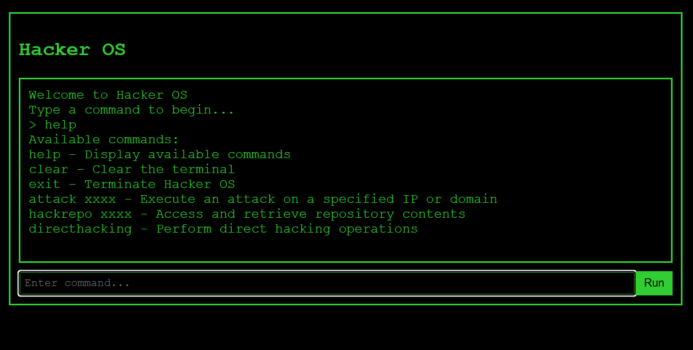

# Hacker OS

This project was created as a follow-up to the [Microsoft Copilot Hackathon Zurich, June 2025](https://events.xebia.com/microsoft-services/copilot-hackathon-zurich-june-2025). The result was achieved almost entirely with Copilot – except for minor manual adjustments, no code was written by hand.

This is a modern terminal-based application, built with Vue.js (CDN) and pure HTML/CSS/JS. The application runs entirely in your browser.

Try it out [here](https://projects.manuelhintermayr.com/hacker-os/).

## Features
- Realistic terminal interface
- Command execution with dynamic outputs
- Keyboard shortcuts for "Access Granted" and "Access Denied"
- Popups for access status
- Responsive design

## Getting Started
1. Download or clone the repository
2. Install dependencies using `npm install`
3. Start the server with `npm start`
4. Open the application in your browser as instructed.

No additional build required!

## Files
- `index.html` – Main file, contains the Vue template
- `script.js` – Application logic (Vue 2)
- `style.css` – Modern styling

## Commands (Short Version)
- `help` – Display available commands
- `clear` – Clear the terminal
- `exit` – Terminate Hacker OS
- `attack xxxx` – Execute an attack on a specified IP or domain
- `hackrepo xxxx` – Access and retrieve repository contents
- `directhacking` – Perform direct hacking operations

## Notes
- The application is designed for local use
- No online functionality

Have fun exploring Hacker OS!
